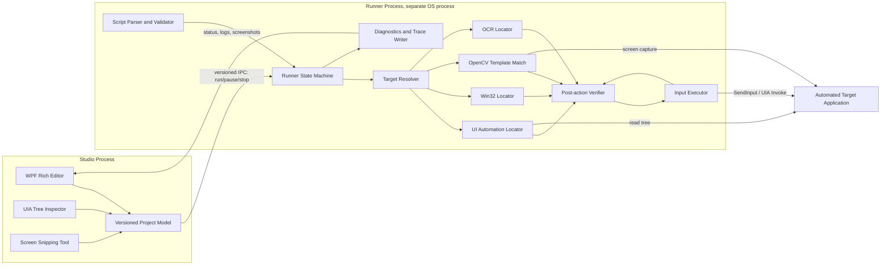
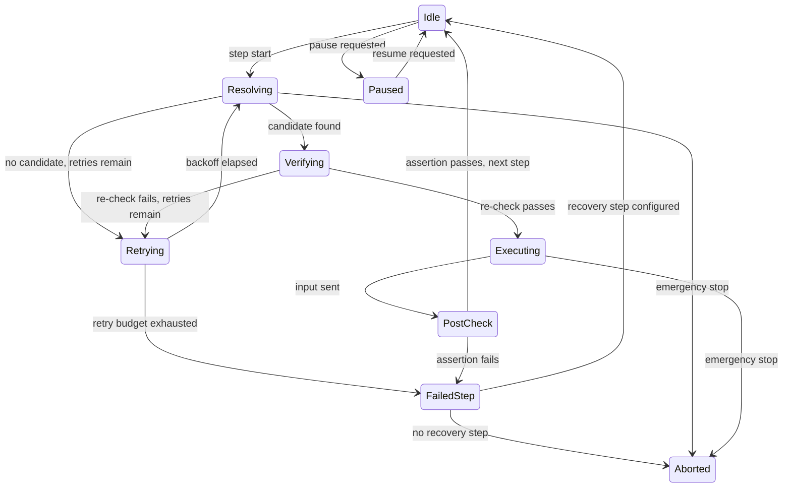

# PixelFlow Automation Studio - Architecture & Technical Plan (v2, Hardened)

Status: superseded draft -> hardened plan. Source material: `PixelFlow Automation Studio Plan.md` (original concept). This document is the canonical, version-controlled plan going forward; the original file is retained only as historical reference and should not be edited further.

**Implementation:** day-to-day executable phases (small, manually testable) live in [phases.md](./phases.md). Copy-paste agent prompt: [agent-phase-prompt.md](./agent-phase-prompt.md).

## 1. Executive Summary

PixelFlow is a Windows desktop automation (RPA) tool for attended use: a human-readable script editor where automation steps resolve to real UI elements through a layered locator strategy, with visual/text matching as a fallback rather than the primary mechanism. The defining goal of this revision is **reliability under real-world UI drift** - app updates, DPI/monitor changes, timing variance, and partially-rendered UI must not silently produce wrong clicks.

Core corrections from the original concept:

- **Stack:** .NET 10 (LTS, supported to November 2028) + C# 14 + WPF, not Python. Windows UI Automation (UIA) is a first-class, in-process capability on .NET and gives structural, resolution-independent locators that OpenCV template matching cannot provide alone.
- **Primary locator:** UI Automation properties (control type, name, `AutomationId`, ancestor path), not images or OCR text. Image/OCR remain as fallback layers for controls that do not expose a usable UIA tree (custom-drawn canvases, games, some Win32/legacy apps).
- **Scope is explicit and bounded**, not "automate anything."

## 2. Product Guarantees and Non-Goals

### In scope for v1

- Windows 10 (22H2+) and Windows 11, x64.
- Attended automation only: the target machine has an active, unlocked, interactive desktop session, and the automation runs as the logged-in user.
- Automating standard desktop application technologies: WPF, WinForms, Win32/MFC, UWP/WinUI, Chromium-based browsers and Electron apps, and JVM/SWT apps where an accessibility bridge is present.
- Recovery from transient UI drift (timing, minor layout shift, window movement) via retries and fallback locators, with a hard failure - not a silent guess - when nothing is found.

### Explicit non-goals / known limitations for v1

- **Secure desktop and UAC consent prompts are not automatable.** Windows renders the UAC consent dialog and the login/lock screen on a separate secure desktop that ordinary processes cannot see or send input to, by design (this is a Windows security boundary, not a bug to work around).
- **Cross-privilege automation is not automatable by default.** A standard-integrity PixelFlow process cannot drive a higher-privilege ("elevated"/administrator) target window; Windows' User Interface Privilege Isolation (UIPI) blocks this. The only sanctioned bypass is the `uiAccess="true"` manifest flag, which itself requires the executable to be Authenticode-signed by a trusted root, installed in a secure system location (e.g. `Program Files`), and permitted by the "Only elevate UIAccess applications that are installed in secure locations" policy (enabled by default). This is a packaging/signing requirement, not a v1 code feature, and is deferred to a later signed-release milestone.
- **Unattended/scheduled/locked-session execution is out of scope for v1.** It requires a different input path (e.g. a session-0 service driving a virtual/RDP session) and is a distinct milestone if pursued later.
- **DRM-protected or GPU-composited protected surfaces** (protected video playback, some anti-cheat-protected windows) cannot be reliably screen-captured or automated and are explicitly unsupported.
- `AutomationId` is documented by Microsoft as optional, not guaranteed unique outside of sibling scope, and not guaranteed stable across app versions - the design in Section 6 treats it as one signal in a chain, never a sole source of truth.
- No general-purpose scripting/code execution sandbox in v1 (see Section 9, Security Model).

## 3. Technology Stack Decision

| Layer | Choice | Rationale |
|---|---|---|
| Runtime | .NET 10 (LTS) | Released Nov 2025, supported to Nov 2028 at time of writing; single LTS runtime for both editor and runner avoids mixed-runtime servicing. |
| Language | C# 14 | First-class UIA interop (`System.Windows.Automation` / `UIAutomationClient` COM), no cross-process marshaling to a scripting runtime. |
| Editor UI | WPF | Mature rich-text/flow-document support for inline image tokens, mature drag/drop, long-term stability over WinUI 3's still-evolving desktop packaging story. |
| Structural locators | Windows UI Automation (UIA3, via `System.Windows.Automation` COM interop or the FlaUI wrapper) | Exposes control type, name, `AutomationId`, bounding rect, and tree structure without pixel matching. |
| Win32 fallback | Native Win32 (`FindWindowEx`, `GetWindowText`, control IDs, `SendInput`) via P/Invoke | Covers legacy controls with weak/no UIA support. |
| Vision fallback | OpenCvSharp4 (OpenCV bindings for .NET) | Multi-scale template matching, in-process, no Python interpreter dependency. |
| OCR fallback | Tesseract (via a .NET wrapper) or Windows.Media.Ocr (WinRT, built into Windows) | Windows.Media.Ocr avoids an extra native dependency entirely on Win10/11; Tesseract kept as an option for accuracy tuning. |
| Fuzzy text matching | A .NET Levenshtein/fuzzy-match library (e.g. FuzzySharp) | Same rationale as original plan (RapidFuzz), .NET-native equivalent. |
| Screen capture | `Windows.Graphics.Capture` (WinRT) or GDI `BitBlt` fallback | In-process, no external capture dependency. |

**Decision: no Python in the v1 production runtime.** A Python sidecar process would add a second runtime to service, a cross-process IPC boundary for every locator call (latency and an extra failure mode), and duplicate packaging/signing work. OpenCvSharp and Windows' own OCR/UIA APIs cover the fallback path natively in .NET. Python is not removed as an idea - it is deferred to an optional, isolated plugin mechanism (Section 9) only if a concrete capability gap is measured against the .NET stack during Phase 3 testing (Section 13).

## 4. System Architecture and Component Boundaries

Two OS processes, split so a hung or crashed automation target cannot freeze the editor, and so a compromised/misbehaving script cannot directly access the editor's file handles or credentials.

- **Studio process**: everything the user edits and sees. Owns the project file, the UIA tree inspector, the snipping tool, and a live view of runner status. Never blocks on target-application I/O.
- **Runner process**: everything that touches the automated target. Started per run, receives a compiled/validated script over a narrow local IPC contract (named pipe, versioned message schema), and can be killed and restarted independently of the Studio if it hangs.
- The **Target Resolver** always tries locators in a defined order (Section 6) and hands a single resolved screen rectangle + element handle to the **Verifier**, which re-checks the element is still valid and still the foreground target immediately before the **Input Executor** acts.
- The IPC contract is versioned (a schema version field on every message) so Studio and Runner can be updated independently without silently misinterpreting each other.

## 5. Project Model and File Format

The rich editor is a **view over a canonical project model**; the model, not the visual editor state, is the source of truth that the Runner consumes. This avoids the classic RPA-tool failure mode where the visual representation and the executable representation drift apart.

- Format: a single project file is a folder-based bundle (e.g. `*.pflow/` or a zipped container) containing:
  - `project.json` - schema version, script steps, locator chains, timeouts, retry policy per step, variables.
  - `assets/` - snipped images referenced by content hash (e.g. `sha256-<hash>.png`), never by mutable file path, so a renamed or replaced asset cannot silently reattach to the wrong step.
  - `history/` - rolling backups written on every save (see below).
- **Atomic saves:** write to a temp file in the same directory, `fsync`, then rename over the target. A crash or power loss during save must never leave a truncated/corrupt `project.json`.
- **Backups:** keep the last N auto-saves (configurable) so a bad save or accidental mass-delete is always recoverable without external version control, while still recommending Git for teams.
- **Schema versioning and migration:** every `project.json` carries a `schemaVersion`. Opening an older file runs a migration step before load; migrations are covered by golden-file tests (Section 10) so old projects never silently corrupt on upgrade.
- **Determinism:** the same `project.json` must parse to the same in-memory script graph every time - no reliance on file system ordering, locale, or ambient state during parse.

## 6. Locator Chain Model (replaces single image/text targets)

Every automatable step resolves through an **ordered, weighted locator chain**, scoped to a specific process and top-level window rather than the whole desktop, both for correctness (don't match the wrong app instance) and performance (don't walk the entire desktop UIA tree).

Resolution order per step:

1. **UI Automation structural match** - `AutomationId` (if present) + `ControlType` + accessible `Name`, constrained to an ancestor path (parent/grandparent chain) captured at recording time. Because `AutomationId` is only guaranteed unique among siblings and is not guaranteed stable across app versions, the recorder always captures it alongside control type, name, and ancestor context - never `AutomationId` alone.
2. **UI Automation semantic match** - accessible name / `LocalizedControlType` without `AutomationId`, for apps that omit it.
3. **Win32 fallback** - window class name + control ID, for legacy controls with a poor or absent UIA tree.
4. **OCR text match** - fuzzy-matched (Levenshtein/FuzzySharp) against on-screen text, for cases with no accessible structure at all.
5. **Image template match** - multi-scale OpenCV `matchTemplate`, last resort for custom-rendered/canvas UI (games, custom controls, icons).

Each layer returns a candidate rectangle plus a confidence score; the resolver stops at the first layer that returns a confidence above its configured threshold, and records which layer actually matched in the run diagnostics (Section 8) so drift is visible over time (e.g. "this step has silently been falling back to image matching for the last 3 runs" is a signal that the app UI changed).

The **recorder/inspector** (in the Studio process) is the authoring surface for this chain:

- Live UIA tree view of the hovered/selected element, showing every candidate property.
- A "test this locator" action that runs resolution against the *current* live screen state and highlights the match (or shows why nothing matched) before the user saves the step - catching bad locators at authoring time, not at run time.
- Manual override to reorder, disable, or add layers per step (e.g. force image-only for a canvas app).

## 7. Runner Execution Semantics and Safety Controls

The Runner executes a script as an explicit, cancellable **state machine**, not an unbounded imperative loop:

Safety controls baked into this state machine:

- **Bounded everything.** Every wait, retry count, and per-step timeout is an explicit, finite value in the project model - no default infinite waits.
- **Deterministic retry budget.** Fixed number of attempts with backoff, not an open-ended "keep trying" loop; exhausting the budget is a first-class `FailedStep` outcome with a defined recovery path (skip, jump to labeled step, or abort), not a crash.
- **Post-action verification.** After every input action, the Verifier re-checks an expected effect (e.g. element state changed, a new window appeared, text field now contains the typed value) before advancing; a step that "sent a click" but produced no observable effect is treated as failed, not successful.
- **Re-resolve immediately before input.** The resolved element/rectangle from the planning phase is re-validated right before `SendInput`/UIA `Invoke` - closing the window between resolution and execution (a real race in RPA tools) is caught, not blindly acted on.
- **Foreground-window and focus safeguards.** Before sending input, the Executor confirms the target window is still the one intended (by process id + window handle, not just title text) and, where the action requires it, brings it to foreground deliberately rather than assuming focus.
- **User-interference detection.** If the physical mouse/keyboard is actively being used by the human operator when a synthetic action is about to fire, the Runner pauses rather than fighting the user for control.
- **DPI- and multi-monitor-aware coordinates.** All coordinates are captured and replayed in device-independent units with the per-monitor DPI and monitor origin recorded; a display-configuration change invalidates cached absolute coordinates and forces re-resolution.
- **Clipboard restoration.** Any step that uses the clipboard (e.g. paste-based text entry) snapshots and restores the previous clipboard contents afterward.
- **Emergency stop.** A global hotkey (e.g. registered via `RegisterHotKey`, independent of which window has focus) is listened for by the Runner at all times during execution and immediately transitions to `Aborted`, canceling in-flight input.
- **Pause/resume boundaries** are only permitted between steps, never mid-input-sequence, so resuming can never replay a half-sent action.

## 8. Diagnostics, Evidence, and Recovery

Every run produces a **self-contained run report**, because "it didn't work" is not actionable without evidence:

- Structured event log (JSON lines): step id, timestamps, which locator layer matched, confidence score, retry count, outcome.
- Target window metadata at time of action: process name/id, window title, window rect, DPI.
- Optional, **opt-in** redacted screenshot capture on failure (off by default for steps flagged as sensitive, to avoid capturing credentials or personal data on screen).
- A human-readable summary view in the Studio (pass/fail per step, screenshots inline, one-click "test this locator now") built on top of the same JSON the Runner wrote - no separate/divergent reporting path.
- Retention policy: run reports rotate (configurable count/age) so diagnostics don't grow unbounded on disk.

## 9. Security Model

- **Project trust prompt** on opening a project from an unfamiliar location, similar to Office/VS Code workspace trust - a project file can contain locator logic that drives real input, so it is treated as executable content, not passive data.
- **No arbitrary code execution in v1.** The script language is a constrained command set (click, type, wait, move, conditional-on-locator-found, loop, call-subroutine) - not embedded C#/Python/JS eval. This removes an entire class of "malicious project file" risk and keeps the parser/validator's job tractable to test exhaustively.
- **Command allowlist and path normalization** for any step that touches the file system or launches a process, to prevent path traversal or unintended process launches from a shared/imported project.
- **Secrets by reference, not by value.** Steps that need credentials reference an OS-level secret store (Windows Credential Manager) by name; secrets are never serialized into `project.json` or run reports.
- **Signed releases** for the shipped Studio/Runner binaries; this is also the prerequisite groundwork for the later `uiAccess` elevated-automation milestone (Section 2), which mandates Authenticode signing and secure-location install.
- **Dependency scanning** (e.g. `dotnet list package --vulnerable` in CI) on every release build.
- **Explicit privilege boundary:** Runner requests no more than the invoking user's standard integrity level in v1; it never silently elevates.

## 10. Test Strategy and Compatibility Matrix

**Phase delivery (director mode):** the implementing agent owns verification for each executable phase in [phases.md](./phases.md) — unit/component tests, live integration against the Test Bench where applicable, end-to-end checklist execution, and phase-scoped timing/performance checks — then fixes until green before marking the phase Done. The human directs scope; they are not the primary QA gate. Process details: [agent-phase-prompt.md](./agent-phase-prompt.md).

Automated test layers:

- **Parser/schema tests**: golden-file round-trip and migration tests across every historical `schemaVersion`.
- **Locator ranking tests**: given a fixture UIA/Win32/pixel snapshot, assert the resolver picks the expected layer and element.
- **State machine tests**: every transition in the Section 7 diagram exercised directly (retry exhaustion, abort mid-execution, pause/resume boundaries, verification failure paths) without needing a real UI.
- **Coordinate transform tests**: DPI scaling, multi-monitor origins, negative-coordinate monitors.
- **Mocked UIA provider tests**: an in-memory fake UIA tree so resolver logic is tested without a real window.

**Test Bench application** (expanded from the original mock UI concept) - a companion app used for integration-level testing across real Windows UI technologies, not just visuals:

| Surface | Purpose |
|---|---|
| WPF panel | Baseline UIA tree with rich `AutomationId` support |
| WinForms panel | Legacy UIA/MSAA bridge behavior |
| Win32/MFC panel | Controls with weak/no UIA, class-name + control-ID fallback |
| Embedded Chromium (WebView2) | Browser accessibility tree behavior |
| Electron sample | Chromium accessibility tree in a separate process |
| Custom-drawn canvas | Forces image/OCR fallback path, no UIA nodes |
| Small icon grid (16x16 icons) | Multi-scale template matching stress test |
| Moving-target button | Element that shifts position after focus/hover, tests re-resolution |
| Low-contrast / noisy background panel | Vision fallback robustness |
| DPI/monitor test harness | Runs the same fixtures at 100/125/150/200% scaling and across a simulated secondary monitor |
| Localization toggle | Same layout re-rendered in a second language, tests name-based matching resilience |
| Theme/dark-mode toggle | Visual-only change that must not affect UIA-based steps |

**Fault injection suite** - deliberately breaks each layer to verify the Runner fails safely rather than misbehaving:

- Element removed from the tree between resolution and execution.
- Stale UIA element reference (window closed and reopened with new handle).
- Focus stolen by another window mid-sequence.
- Simulated timeout (target app hangs / stops responding).
- Target application crash mid-run.
- Display configuration change (resolution, DPI, monitor added/removed) mid-run.
- Real physical mouse/keyboard input arriving mid-action (interference detection).
- Corrupt/truncated `project.json` on load.
- Runner process killed externally; Studio must detect and report, not hang.

## 11. Release Gates (measurable, per milestone)

A milestone is not "done" on feature completion; it is done when these hold:

- **No data loss** across 100 simulated interrupted saves (process killed mid-write) - project always recoverable from the last good atomic save or backup.
- **Emergency stop latency** under a defined bound (e.g. input cancellation observable within 150ms of hotkey) measured automatically in CI/test harness.
- **Timeout accuracy**: configured per-step timeouts fire within a tight tolerance band, not "eventually."
- **Target-resolution success rate** tracked per Test Bench surface (Section 10); a regression in any surface blocks release.
- **Zero unintended actions** across the adversarial fault-injection suite (Section 10) - a failed resolution must always produce `FailedStep`/`Aborted`, never a guessed click.
- **Deterministic replay diagnostics**: given a saved run report, a developer can reproduce which locator layer/element would have matched, without re-running against a live target.
- **Clean install/update/uninstall** verified on a fresh Windows 10 and Windows 11 VM image, including old-project migration.

## 12. Roadmap: Vertical, Gated Milestones

Each milestone must pass its own release gate (Section 11) before the next starts; features are not layered on top of an unproven core.

1. **M0 - Project model and Runner skeleton.** `project.json` schema, atomic save/load, migration test harness, Runner process with the state machine (Section 7) running against a no-op/mocked resolver. Gate: no-data-loss and state-machine tests green.
2. **M1 - UIA inspector and one verified click flow.** Real UIA locator layer, recorder/inspector in Studio, end-to-end "click a real WPF button by AutomationId chain" with post-action verification. Gate: WPF/WinForms Test Bench surfaces pass; emergency stop and timeout gates pass.
3. **M2 - Fallback layers.** Win32 fallback, OCR fallback, OpenCV multi-scale image fallback, locator-chain ranking and confidence scoring. Gate: full Test Bench matrix (Section 10) passes, including custom-canvas and icon-grid surfaces.
4. **M3 - Resilient editor and recorder.** Full rich-text editor with inline image tokens, drag/drop, screen-snipping hotkey tool, "test this locator" live action, project backups/history. Gate: authoring workflow usable end-to-end without touching raw JSON.
5. **M4 - Diagnostics and recovery.** Run reports, redacted screenshot capture, retention policy, recovery-step configuration (skip/jump/abort), user-interference detection, clipboard restoration. Gate: fault-injection suite fully green.
6. **M5 - Compatibility hardening.** DPI/multi-monitor matrix, localization matrix, Electron/WebView2 surfaces, display-change invalidation. Gate: compatibility release-gate metrics met across the full Test Bench matrix.
7. **M6 - Signed packaging and beta.** Code-signed installer, dependency vulnerability scanning in CI, project trust prompt, secret-reference support. This milestone is also the enabling groundwork (but not the delivery) of the later elevated/`uiAccess` capability. Gate: clean install/update/uninstall on fresh VM images; external beta sign-off.

## 13. Architecture Decision Records

**ADR-1: WPF over WinUI 3 for the Studio shell.**
Rich flow-document editing with inline images and drag/drop is mature and well-documented in WPF today; WinUI 3's desktop packaging and rich-text story is comparatively less proven for this exact use case. Revisit if WinUI 3's editing/packaging maturity closes the gap in a future .NET release.

**ADR-2: .NET-only core, no Python sidecar in v1.**
UIA interop, OpenCvSharp, and Windows' built-in OCR cover the full locator stack in-process. A Python sidecar would add a second runtime, an IPC hop on every locator call, and duplicate signing/packaging work, for no capability we can't already get natively. Revisit only if a specific, measured capability gap appears in Phase/Milestone testing.

**ADR-3: UIA-first, multi-signal locator chains instead of single image/text targets.**
`AutomationId` alone is insufficient (optional, sibling-scoped uniqueness only, not stable across versions per Microsoft's own documentation), so every step records a chain of signals with image/OCR as true fallbacks, not co-equal defaults. This is the single highest-leverage change for reliability versus the original plan.

**ADR-4: Studio and Runner are separate OS processes.**
Isolates editor responsiveness from target-application hangs/crashes, and creates a clean privilege/trust boundary between "editing a project" and "a project's steps are actively driving input."

**ADR-5: Canonical JSON project model behind the rich editor.**
Prevents the visual editor's in-memory state from silently diverging from what the Runner actually executes; enables atomic saves, backups, and schema migration independent of UI changes.

**ADR-6: v1 targets attended, interactive-session automation only.**
Unattended/session-0/locked-session automation requires a fundamentally different input-delivery mechanism (service + virtual session) and elevated/`uiAccess` packaging; scoping it out of v1 keeps the core reliability work focused and avoids shipping a security boundary workaround half-finished.

## 14. Risk Register

| Risk | Impact | Mitigation | Test gate |
|---|---|---|---|
| UIA tree inconsistency across app frameworks/versions | Wrong element resolved or nothing found | Multi-signal locator chains (Section 6); ancestor-path scoping | Test Bench matrix per-surface resolution rate (Section 11) |
| Privilege mismatch (target elevated, Runner standard) | Automation silently no-ops or cannot send input | Detect target process integrity level pre-run; fail fast with a clear error instead of a confusing silent failure | Fault-injection case: elevated target window |
| DPI/display configuration drift | Coordinates land on the wrong element after a monitor/DPI change | DPI-aware coordinate capture; display-change invalidation forcing re-resolution (Section 7) | Coordinate transform tests; DPI/monitor Test Bench harness |
| Image/OCR false positives | Wrong element clicked when relying on fallback layers | Confidence thresholds per layer; OCR is fuzzy-matched but bounded; fallback layers only engage when higher-confidence layers fail | Fault-injection + Test Bench low-contrast/noisy surfaces |
| Real user interference during a run | Race between human and synthetic input, unpredictable state | User-interference detection pauses the Runner (Section 7) | Fault-injection: live input during action |
| Dependency/packaging regressions (OpenCvSharp native binaries, OCR engine) | Install fails or a native dependency mismatch crashes the Runner | Signed, tested installer; CI matrix on fresh Win10/Win11 VM images; dependency vulnerability scanning | Clean install/update/uninstall gate (Section 11) |
| Script/project schema drift across versions | Old projects fail to load or silently misbehave after an app update | Explicit `schemaVersion` + migration tests on every historical version (Section 5, Section 10) | Golden-file migration test suite |
